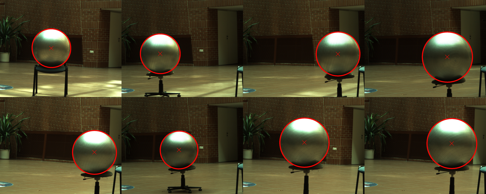
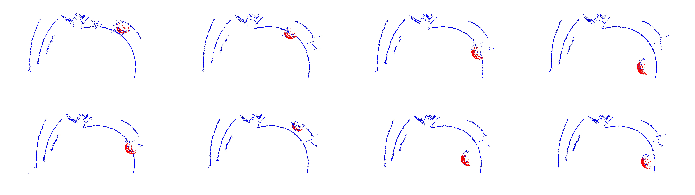

# sphere-calibration

Essentially a port of [SphereCalib](https://github.com/tothtekla/SphereCalib) to Python. The algorithm involves calculating the sphere's center using lidar point clouds and camera images, then retrieving the pose through optimal point set registration. At least three sphere center point correspondences are needed to determine the extrinsic parameter.

## Examples
`est_center_img.py` finds the sphere centers from 2D images. It's only possible if the camera's intrinsic parameter is known along with the sphere radius. The dataset is also taken from SphereCalib.



`est_center_pcl.py` finds the sphere centers from 3D point cloud data. 



`registration.py` performs optimal point set registration between the estimated sphere center correspondences to obtain the rotation and translation information. 

Example output:

```
rotation:
[[ 0.96404951 -0.10091104  0.24581599]
 [-0.25726916 -0.12297815  0.95848263]
 [-0.06649148 -0.98726559 -0.14451832]]

translation:
[ 0.29092707 -3.98093852  0.78115227]
```

Running `est_center_img.py` and `est_center_pcl.py` directly are only useful for parameter testing and visualization purposes. To find the pose, use `registration.py`.   

## Notes
Estimated sphere centers from images and point clouds are derived from the "minimum" RANSAC solutions. For more accurate center estimation, perform local optimization using the inlier points.

Automatic ellipse detection using a circle is not robust. Strict parameter tuning may be required. Better methods exist, such as this. 

## References
T. Tóth, Z. Pusztai and L. Hajder, "Automatic LiDAR-Camera Calibration of Extrinsic Parameters Using a Spherical Target," 2020 IEEE International Conference on Robotics and Automation (ICRA), Paris, France, 2020, pp. 8580-8586, doi: 10.1109/ICRA40945.2020.9197316.

Arun, K.S. & Huang, T.S. & Blostein, Steven. (1987). Least-squares fitting of two 3-D point sets. IEEE T Pattern Anal. Pattern Analysis and Machine Intelligence, IEEE Transactions on. PAMI-9. 698 - 700. 10.1109/TPAMI.1987.4767965. 

Ellipse, Wolfram Mathworld. [[Link]](https://mathworld.wolfram.com/Ellipse.html).
